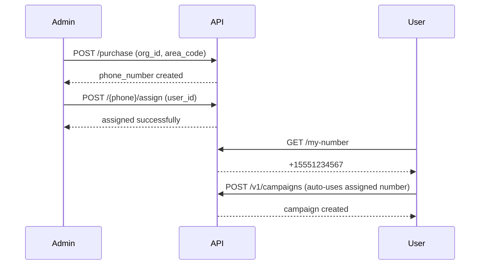

# SMS Phone Numbers

<Note>
**Multi-SMS Feature**: This section is only applicable for tenants that have multiple SMS numbers per organization enabled. The standard configuration is one SMS number per organization. Contact support if you need multi-SMS capabilities.
</Note>

The SMS Phone Numbers API allows organizations to manage multiple SMS numbers with user-level assignment. Each user can have their own dedicated SMS number for campaigns.

## Feature Overview

<Info>
This feature must be enabled for your tenant. Contact support to enable multi-SMS numbers for your organization.
</Info>

### How It Works

1. **Organization purchases SMS numbers** - Numbers are purchased under the org's 10DLC campaign
2. **Admin assigns to users** - Each number can be assigned to a specific user
3. **User creates campaigns** - Campaigns automatically use the user's assigned number
4. **Inbound messages route correctly** - Replies go to the correct user's campaigns

### Key Benefits

- **User Isolation** - Each user has their own dedicated SMS number
- **Clear Attribution** - Know which user sent which messages
- **Scalability** - Add as many numbers as needed (within limits)
- **Billing Transparency** - Track costs per number

## Prerequisites

Before using multi-SMS numbers:

1. Organization must have **10DLC approved** (SMS active)
2. Tenant must have **`enable_multi_sms_numbers`** enabled
3. Organization must be within their **number limit**

## API Endpoints

| Method | Endpoint | Description | Permissions |
|--------|----------|-------------|-------------|
| POST | `/v1/sms/phone-numbers/purchase` | Purchase new SMS number | Any authenticated user |
| GET | `/v1/sms/phone-numbers` | List org's SMS numbers | Any authenticated user |
| GET | `/v1/sms/phone-numbers/available` | List unassigned numbers | Any authenticated user |
| POST | `/v1/sms/phone-numbers/{phone}/assign` | Assign to user | **Admin only** |
| DELETE | `/v1/sms/phone-numbers/{phone}/assign` | Unassign from user | **Admin only** |
| GET | `/v1/sms/phone-numbers/my-number` | Get user's SMS number | Any authenticated user |
| GET | `/v1/sms/phone-numbers/config` | Get configuration | Any authenticated user |

## Workflow Example

## Billing

- **Weekly billing** per phone number
- Price configured per tenant (default: $2.99/week)
- Billed automatically via existing billing system
- Tracked in `usage_logs` with `event_type: phone_number_weekly`

## Related

- [Purchase SMS Number](/partner-api/sms-phone-numbers/purchase)
- [List SMS Numbers](/partner-api/sms-phone-numbers/list)
- [Assign to User](/partner-api/sms-phone-numbers/assign)
- [Get My Number](/partner-api/sms-phone-numbers/my-number)
- [SMS Phone Config](/partner-api/sms-phone-numbers/config)
- [10DLC Registration](/partner-api/10dlc/overview)
